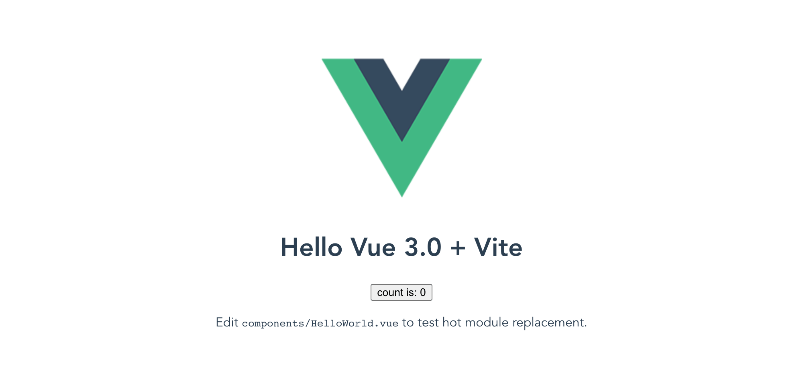
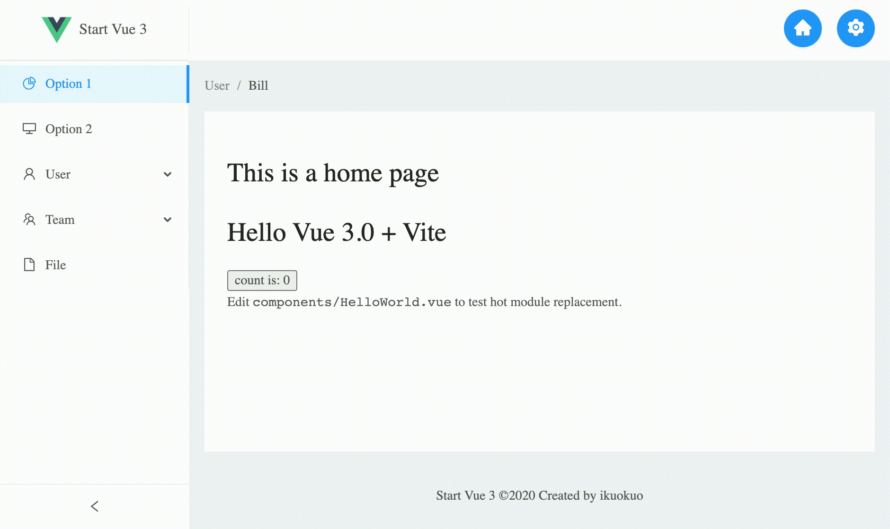

# Start Vue 3 and Ant Design

[See live demo](https://ikuokuo.github.io/start-vue3/) 👀

## Create via Vite

```zsh
yarn create vite-app my-site
cd my-site
yarn
yarn dev
```

Run:

```zsh
❯ yarn dev
yarn run v1.22.10
warning package.json: No license field
$ vite
vite v1.0.0-rc.4
[vite] Optimizable dependencies detected:
vue

  Dev server running at:
  > Local:    http://localhost:3000/
  > Network:  http://192.168.1.100:3000/
```

Visit:



## Changes from Vue 2

- [Migration Guide](https://v3.vuejs.org/guide/migration/introduction.html)

## Vite Config

- [Vite - Config File](https://github.com/vitejs/vite#config-file)

```js
import { resolve } from "path";

function pathResolve(dir: string) {
  return resolve(__dirname, ".", dir);
}

module.exports = {
  alias: {
    "/@/": pathResolve("src"),
  },
  optimizeDeps: {
    include: ["@ant-design/icons-vue"],
  },
};
```

## Preparation

### [eslint-plugin-vue](https://eslint.vuejs.org/)

```zsh
yarn add -D eslint eslint-plugin-vue
```

`.eslintrc.js`:

```js
module.exports = {
  extends: [
    // add more generic rulesets here, such as:
    // "eslint:recommended",
    "plugin:vue/vue3-recommended",
    // "plugin:vue/recommended" // Use this if you are using Vue.js 2.x.
  ],
  rules: {
    // override/add rules settings here, such as:
    "vue/no-multiple-template-root": "off",
  },
};
```

### TypeScript


```zsh
yarn add -D typescript
```

- [Vue3 - TypeScript](https://v3.vuejs.org/guide/typescript-support.html)
- [Vite - TypeScript](https://github.com/vitejs/vite#typescript)

### [Vue Router](https://github.com/vuejs/vue-router-next)


```zsh
yarn add vue-router@next
```

### [Vuex](https://github.com/vuejs/vuex/tree/4.0)


```zsh
yarn add vuex@next
```

### [Ant Design Vue](https://github.com/vueComponent/ant-design-vue/)


```zsh
yarn add ant-design-vue@next
# import on demand
yarn add -D babel-plugin-import

# https://github.com/vueComponent/ant-design-vue/issues/2798
yarn add @ant-design/colors
```

<!--
yarn add @ant-design/icons-vue
-->

`.babelrc`:

```js
{
  "plugins": [
    ["import", { "libraryName": "ant-design-vue", "libraryDirectory": "es", "style": "css" }] // `style: true` 会加载 less 文件
  ]
}
```

### Others

```zsh
yarn add -D sass
```

## Go Coding

### Use TypeScript

- Rename `main.js` to `main.ts`
- Edit `index.html`, replace `/src/main.js` with `/src/main.ts`

  ```html
  ...
  <body>
    <div id="app"></div>
    <script type="module" src="/src/main.ts"></script>
  </body>
  </html>
  ```

### Use Vue Router

`router/index.ts`:

```ts
import { createRouter, createWebHistory } from "vue-router";

const routes = [
  {
    path: "/",
    name: "Home",
    component: () => import("/@/views/Home.vue"),
  },
  {
    path: "/setting",
    name: "Setting",
    component: () => import("/@/views/Setting.vue"),
  },
];

export default createRouter({
  history: createWebHistory(),
  routes,
});
```

### Use Vuex

`store/index.ts`:

```ts
import { createStore } from "vuex";

export default createStore({
  state() {
    return {
      count: 0,
    };
  },
  mutations: {
    increment(state) {
      state.count++;
    },
  },
  actions: {
    increment(context) {
      context.commit("increment");
    },
  },
});
```

### Add Views

`views/Home.vue`:

```vue
<template>
  <h1>This is a home page</h1>
  <HelloWorld msg="Hello Vue 3.0 + Vite" />
</template>

<script lang="ts">
import { defineComponent } from "vue";

import HelloWorld from "/@/components/HelloWorld.vue";

export default defineComponent({
  name: "Home",
  components: {
    HelloWorld,
  },
});
</script>
```

`views/Setting.vue`:

```vue
<template>
  <div>
    <h1>This is a setting page</h1>
    <p>store count is: {{ count }}</p>
  </div>
</template>

<script lang="ts">
import { defineComponent } from "vue";

export default defineComponent({
  name: "Setting",
  computed: {
    count() {
      return this.$store.state.count;
    },
  },
});
</script>
```

### Update `main.ts`

```ts
import { createApp } from "vue";
import router from "/@/router";
import store from "/@/store";

import Antd from "ant-design-vue";
import "ant-design-vue/dist/antd.css";

import App from "/@/App.vue";
import "/@/styles/index.scss";

const app = createApp(App);
app.use(router);
app.use(store);
app.use(Antd);
app.mount("#app");
```

### Update `App.vue`

```html
<a-layout-header style="background: #fff; padding: 0">
  <a-row type="flex" justify="end">
    <a-col class="mr-3">
      <a-button
        type="primary"
        shape="circle"
        size="large"
        @click="this.$router.push('/')"
      >
        <template #icon><HomeFilled /></template>
      </a-button>
    </a-col>
    <a-col class="mr-3">
      <a-button
        type="primary"
        shape="circle"
        size="large"
        @click="this.$router.push('/setting')"
      >
        <template #icon><SettingFilled /></template>
      </a-button>
    </a-col>
  </a-row>
</a-layout-header>
<a-layout-content style="margin: 0 16px">
  <div :style="{ padding: '24px', background: '#fff', minHeight: '360px' }">
    <router-view />
  </div>
</a-layout-content>
```



## Deploy to GitHub Pages

Edit `vite.config.ts`, add base path:

```js
module.exports = {
  // otherwise, may assets 404 or visit with index.html
  base: "/start-vue3/",
  assetsDir: "",
};
```

Edit `router/index.ts`, add base path:

```ts
export default createRouter({
  history: createWebHistory("/start-vue3/"),
  routes,
});
```

Build and deploy:

```zsh
cd my-site
yarn build

export GIT_HASH=`git rev-parse --short HEAD`

cd dist/
git init
git remote add origin git@github-ik:ikuokuo/start-vue3.git
git checkout --orphan gh-pages
git add .
git commit -m "deploy website - based on $GIT_HASH"
git push origin gh-pages
```

<!--
touch .nojekyll
-->

Visit: https://ikuokuo.github.io/start-vue3/.

## References

- [Vue 3 - Docs](https://v3.vuejs.org/guide/)
- [Ant Design Vue - Docs](https://2x.antdv.com/)
- [Vue Vben Admin](https://github.com/anncwb/vue-vben-admin)
- [Deploying a subfolder to GitHub Pages](https://gist.github.com/cobyism/4730490)
